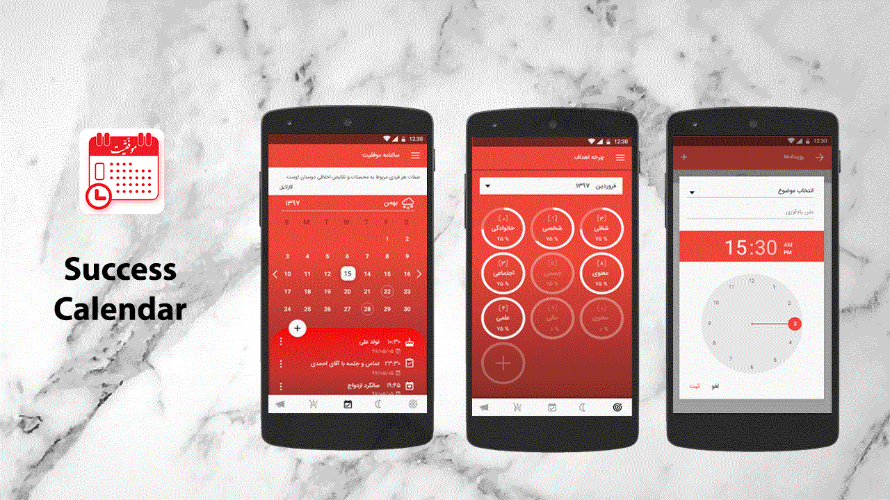

# Success Calendar

a calendar for your daily life, reminds you of your special events and also helps you to be successful in life

## Getting Started

These instructions will get you a copy of the project up and running on your local machine for development and testing purposes.

### Prerequisites

What things you need to install the software and how to install them

you'll just need Gradle 4.6

### Installing

import it as a new project and you are good to go

## Deployment

Add additional notes about how to deploy this on a live system

## Built With

* [Maven](https://maven.apache.org/) - Dependency Management

## Authors

* **Mohammad Rostami** 

## Acknowledgments

* Hat tip to anyone whose code was used
* Inspiration
* etc
